# Agentic SDLC Control Plane

This is the 1-page control-plane view for turning coding agents from ad-hoc assistants into governed SDLC actors.

## Core thesis

Agentic SDLC is becoming a **control-plane problem**, not a chatbot problem.

The enterprise value is not “the agent can code”. The value is whether the organisation can safely route SDLC events into agents, constrain execution, inspect evidence, measure outcomes, and recover when the agent is wrong.

## Control-plane diagram

```mermaid
flowchart LR
  subgraph Inputs[SDLC inputs]
    I1[Issues / Jira tickets]
    I2[Pull requests]
    I3[CI failures]
    I4[Docs drift]
    I5[Incidents / runbooks]
  end

  subgraph Context[Context pack]
    C1[Repo scan]
    C2[Relevant files]
    C3[Build/test history]
    C4[Policies]
    C5[Human intent]
  end

  subgraph Runtime[Agent runtime]
    R1[GitHub Actions runner]
    R2[Local runner]
    R3[Persistent cloud env]
    R4[Provider adapter: Amp / Copilot / Codex]
  end

  subgraph Controls[Governance controls]
    G1[Policy engine]
    G2[Secrets boundary]
    G3[Sandbox / allowlist]
    G4[Human gates]
    G5[Risk classifier]
  end

  subgraph Outputs[Agent outputs]
    O1[PR / patch]
    O2[Review comment]
    O3[Runbook update]
    O4[Audit report]
    O5[Confidence score]
  end

  subgraph Metrics[Operating metrics]
    M1[Cost]
    M2[Time saved]
    M3[Rollback rate]
    M4[Human review burden]
    M5[Policy blocks]
  end

  Inputs --> Context --> Runtime --> Outputs --> Metrics
  Controls --> Runtime
  Controls --> Outputs
  Runtime --> Controls
```



## Minimum governed workflow

```text
trigger
→ context pack
→ requirement / failure interpretation
→ proposed plan
→ policy + human gate
→ controlled execution
→ validation
→ diff / PR preview
→ audit report
→ optional PR/comment/update after approval
```

## Design implications

- Agents should run **phase-by-phase**, not as one unrestricted end-to-end prompt.
- CI/CD-native execution matters because enterprises already understand runners, logs, permissions, and approvals.
- `GITHUB_TOKEN`/short-lived credentials are preferable to long-lived PATs.
- The control plane owns state, policy, gates, evidence, cost attribution, and auditability.
- Provider choice matters less than whether the workflow can be inspected and constrained.

## K-use cases

- Enterprise presentation: show the maturity shift from chat assist → repo-aware agent → CI-triggered governed agent.
- Prototype: CI failure explainer + patch proposal using a mock provider first.
- Product wedge: an agent risk gate for shell/file/network/git actions in local or CI agent workflows.
